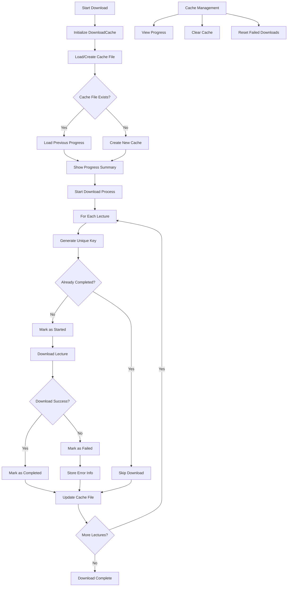

# Udemy Downloader By Joe - Complete Documentation

This comprehensive guide will walk you through every step of setting up and using the Udemy Downloader By Joe, from initial installation to downloading your first course.

## Table of Contents

1. [System Requirements](#system-requirements)
2. [Step-by-Step Installation](#step-by-step-installation)
3. [Authentication Setup](#authentication-setup)
4. [Configuration Guide](#configuration-guide)
5. [Course ID Extraction](#course-id-extraction)
6. [Usage Scenarios](#usage-scenarios)
7. [DRM Content Handling](#drm-content-handling)
8. [Advanced Features](#advanced-features)
9. [Download Cache & Resume System](#download-cache--resume-system)
10. [Troubleshooting Guide](#troubleshooting-guide)
11. [Performance Optimization](#performance-optimization)
12. [Best Practices](#best-practices)

---

## System Requirements

### Minimum Requirements
- **Operating System**: Windows 10/11, macOS 10.14+, Ubuntu 18.04+
- **Python**: Version 3.8 or higher
- **RAM**: 4GB minimum, 8GB recommended
- **Storage**: 500MB for tools, plus space for downloaded courses
- **Internet**: Stable broadband connection (recommended: 10+ Mbps)

### Recommended Specifications
- **CPU**: Quad-core processor for optimal concurrent downloads
- **RAM**: 16GB for large courses with high concurrency
- **Storage**: SSD with 100GB+ free space
- **Internet**: 25+ Mbps for maximum download speeds

---

## Step-by-Step Installation

### Step 1: Install Python

#### Windows
1. Visit [python.org](https://www.python.org/downloads/)
2. Download Python 3.11 or later
3. **Important**: Check "Add Python to PATH" during installation
4. Verify installation:
   ```cmd
   python --version
   pip --version
   ```

#### macOS
```bash
# Using Homebrew (recommended)
brew install python

# Or download from python.org
```

#### Linux (Ubuntu/Debian)
```bash
sudo apt update
sudo apt install python3 python3-pip
```

### Step 2: Install FFmpeg

FFmpeg is a crucial multimedia framework required for video processing and conversion. Here are detailed installation instructions for beginners:

#### Windows

##### Option A: Manual Installation (Recommended for Beginners)

1. **Download FFmpeg**:
   - Go to [https://ffmpeg.org/download.html](https://ffmpeg.org/download.html)
   - Click on "Windows" and then "Windows builds by BtbN"
   - Download the latest "release" version (NOT essentials)
   - Choose `ffmpeg-master-latest-win64-gpl.zip`

2. **Extract FFmpeg**:
   - Create a new folder: `C:\ffmpeg`
   - Extract the downloaded ZIP file
   - Copy all contents from the extracted folder to `C:\ffmpeg`
   - You should have: `C:\ffmpeg\bin\ffmpeg.exe`

3. **Add to System PATH** (Critical Step):
   - Press `Windows + R`, type `sysdm.cpl`, press Enter
   - Click "Environment Variables" button
   - In "System Variables" section, find and select "Path"
   - Click "Edit" → "New"
   - Add: `C:\ffmpeg\bin`
   - Click "OK" on all windows
   - **Restart your command prompt/terminal**

4. **Verify Installation**:
   ```cmd
   ffmpeg -version
   ```
   You should see FFmpeg version information.

##### Option B: Using Chocolatey (For Advanced Users)

1. **Install Chocolatey first** (if not installed):
   - Open PowerShell as Administrator
   - Run: 
   ```powershell
   Set-ExecutionPolicy Bypass -Scope Process -Force; [System.Net.ServicePointManager]::SecurityProtocol = [System.Net.ServicePointManager]::SecurityProtocol -bor 3072; iex ((New-Object System.Net.WebClient).DownloadString('https://community.chocolatey.org/install.ps1'))
   ```

2. **Install FFmpeg**:
   ```cmd
   choco install ffmpeg
   ```

##### Option C: Using Winget (Windows 10/11)

1. **Open Command Prompt or PowerShell**
2. **Install FFmpeg**:
   ```cmd
   winget install "FFmpeg (Essentials Build)"
   ```

#### macOS

##### Using Homebrew (Recommended)

1. **Install Homebrew** (if not installed):
   ```bash
   /bin/bash -c "$(curl -fsSL https://raw.githubusercontent.com/Homebrew/install/HEAD/install.sh)"
   ```

2. **Install FFmpeg**:
   ```bash
   brew install ffmpeg
   ```

3. **Verify Installation**:
   ```bash
   ffmpeg -version
   ```

##### Manual Installation (Alternative)

1. Download from [https://evermeet.cx/ffmpeg/](https://evermeet.cx/ffmpeg/)
2. Extract and move to `/usr/local/bin/`
3. Make executable: `chmod +x /usr/local/bin/ffmpeg`

#### Linux

##### Ubuntu/Debian
```bash
# Update package list
sudo apt update

# Install FFmpeg
sudo apt install ffmpeg

# Verify installation
ffmpeg -version
```

##### CentOS/RHEL/Fedora
```bash
# Enable EPEL repository (CentOS/RHEL)
sudo yum install epel-release

# Install FFmpeg
sudo yum install ffmpeg
# OR for newer versions
sudo dnf install ffmpeg

# Verify installation
ffmpeg -version
```

##### Arch Linux
```bash
# Install FFmpeg
sudo pacman -S ffmpeg

# Verify installation
ffmpeg -version
```

---

### Step 3: Download Required Tools

#### 🚀 N_m3u8DL-RE (Video Downloader)

This tool is essential for downloading video content. Follow these detailed steps:

##### For Windows Users:

1. **Visit the Release Page**:
   - Go to [https://github.com/nilaoda/N_m3u8DL-RE/releases](https://github.com/nilaoda/N_m3u8DL-RE/releases)
   - Look for the latest release (green "Latest" tag)

2. **Download the Correct File**:
   - Scroll down to "Assets"
   - Download: `N_m3u8DL-RE_Beta_win-x64.zip`
   - **File size should be around 15-20 MB**

3. **Extract and Setup**:
   - Extract the ZIP file to a temporary folder
   - Find the executable file (usually named `N_m3u8DL-RE.exe`)
   - **IMPORTANT**: Rename it to `n_m3u8dl-re.exe` (lowercase with dashes)
   - Copy `n_m3u8dl-re.exe` to your project folder

4. **Final Location**:
   ```
   udemy-downloader-by-joe/
   ├── main.py
   ├── n_m3u8dl-re.exe  ← Should be here
   └── other files...
   ```

##### For macOS Users:

1. **Download**:
   - From the same releases page, download: `N_m3u8DL-RE_Beta_osx-x64.tar.gz`

2. **Extract and Setup**:
   ```bash
   # Extract the file
   tar -xzf N_m3u8DL-RE_Beta_osx-x64.tar.gz
   
   # Make executable
   chmod +x N_m3u8DL-RE
   
   # Rename and move to project folder
   mv N_m3u8DL-RE /path/to/udemy-downloader-by-joe/n_m3u8dl-re
   ```

##### For Linux Users:

1. **Download**:
   - Download: `N_m3u8DL-RE_Beta_linux-x64.tar.gz`

2. **Extract and Setup**:
   ```bash
   # Extract the file
   tar -xzf N_m3u8DL-RE_Beta_linux-x64.tar.gz
   
   # Make executable
   chmod +x N_m3u8DL-RE
   
   # Rename and move to project folder
   mv N_m3u8DL-RE /path/to/udemy-downloader-by-joe/n_m3u8dl-re
   ```

#### 🔐 Shaka Packager (For DRM Content)

This tool is needed only for DRM-protected courses:

##### For Windows Users:

1. **Visit the Release Page**:
   - Go to [https://github.com/shaka-project/shaka-packager/releases](https://github.com/shaka-project/shaka-packager/releases)
   - Look for the latest release

2. **Download the Correct File**:
   - Download: `packager-win-x64.exe`
   - **File size should be around 4-6 MB**

3. **Setup**:
   - **IMPORTANT**: Rename to `shaka-packager.exe`
   - Place in your project folder

4. **Final Location**:
   ```
   udemy-downloader-by-joe/
   ├── main.py
   ├── n_m3u8dl-re.exe
   ├── shaka-packager.exe  ← Should be here
   └── other files...
   ```

##### For macOS Users:

1. **Download**:
   - Download: `packager-osx-x64`

2. **Setup**:
   ```bash
   # Make executable
   chmod +x packager-osx-x64
   
   # Rename and move to project folder
   mv packager-osx-x64 /path/to/udemy-downloader-by-joe/shaka-packager
   ```

##### For Linux Users:

1. **Download**:
   - Download: `packager-linux-x64`

2. **Setup**:
   ```bash
   # Make executable
   chmod +x packager-linux-x64
   
   # Rename and move to project folder
   mv packager-linux-x64 /path/to/udemy-downloader-by-joe/shaka-packager
   ```

#### 📁 Where Should the .exe Files Be Located?

Your project folder should look exactly like this:

```
📁 udemy-downloader-by-joe/
├── 📄 main.py
├── 📄 get_course.py
├── 📄 requirements.txt
├── 📄 .env (you'll create this)
├── 📄 cookies.json (you'll create this)
├── 🔧 n_m3u8dl-re.exe (Windows) or n_m3u8dl-re (macOS/Linux)
├── 🔧 shaka-packager.exe (Windows) or shaka-packager (macOS/Linux)
├── 📁 utils/
├── 📁 docs/
└── 📁 courses/ (will be created automatically)
```

#### ✅ Verification Steps

After placing all files, verify everything is working:

1. **Test FFmpeg**:
   ```bash
   ffmpeg -version
   ```

2. **Test N_m3u8DL-RE**:
   ```bash
   # Windows
   .\n_m3u8dl-re.exe --version
   
   # macOS/Linux
   ./n_m3u8dl-re --version
   ```

3. **Test Shaka Packager**:
   ```bash
   # Windows
   .\shaka-packager.exe --version
   
   # macOS/Linux
   ./shaka-packager --version
   ```

If any command fails, double-check:
- File names are exactly as specified (case-sensitive)
- Files are in the correct location
- Files have proper permissions (executable on macOS/Linux)
- PATH is set correctly for FFmpeg

### Step 4: Download and Setup the Downloader

#### Option A: Download Release (Recommended)
1. Go to the [Releases page](../../releases)
2. Download the latest `udemy-downloader-by-joe.zip`
3. Extract to your desired location (e.g., `C:\Tools\udemy-downloader-by-joe`)

#### Option B: Clone from GitHub
```bash
git clone https://github.com/your-username/udemy-downloader-by-joe.git
cd udemy-downloader-by-joe
```

### Step 5: Install Python Dependencies

Navigate to the project folder and install dependencies:

```bash
cd udemy-downloader-by-joe
pip install -r requirements.txt
```

If you encounter permission issues on Windows:
```cmd
pip install --user -r requirements.txt
```

### Step 6: Place Executable Files

Place the downloaded tools in the project folder:
```
udemy-downloader-by-joe/
├── main.py
├── get_course.py             # Course ID extractor
├── n_m3u8dl-re.exe          # (Windows) or n_m3u8dl-re
├── shaka-packager.exe       # (Windows) or shaka-packager
└── ...
```

**Alternative**: Add tools to system PATH and update `.env` accordingly.

---

## Authentication Setup

### Method 1: JSON Cookies (Recommended)

#### Using Browser Extension

1. **Install Extension**:
   - Chrome/Edge: [Cookie Editor](https://chrome.google.com/webstore/detail/cookie-editor/hlkenndednhfkekhgcdicdfddnkalmdm)
   - Firefox: [Cookie Editor](https://addons.mozilla.org/en-US/firefox/addon/cookie-editor/)

2. **Export Cookies**:
   - Log into Udemy in your browser
   - Click the Cookie Editor extension icon
   - Click "Export" → "JSON"
   - Save as `cookies.json` in the project folder

#### Using Developer Tools (Manual)

1. **Open Developer Tools**:
   - Press `F12` or right-click → "Inspect"
   - Go to "Application" tab (Chrome) or "Storage" tab (Firefox)

2. **Export Cookies**:
   - Navigate to "Cookies" → "https://www.udemy.com"
   - Copy all cookie data into JSON format:

```json
[
  {
    "name": "access_token",
    "value": "your_access_token_here",
    "domain": ".udemy.com",
    "path": "/",
    "secure": true,
    "httpOnly": true
  },
  {
    "name": "client_id",
    "value": "your_client_id_here",
    "domain": ".udemy.com",
    "path": "/",
    "secure": true,
    "httpOnly": false
  }
]
```

### Method 2: Netscape Format Cookies

Use tools like:
- [Get cookies.txt](https://chrome.google.com/webstore/detail/get-cookiestxt/bgaddhkoddajcdgocldbbfleckgcbcid)
- Command line tools like `cookies.txt`

Save as `cookies.txt` in Netscape format:
```
# Netscape HTTP Cookie File
.udemy.com	TRUE	/	TRUE	1234567890	access_token	your_token_here
.udemy.com	TRUE	/	FALSE	1234567890	client_id	your_client_id_here
```

### Verifying Authentication

Test your cookies with a simple download:
```bash
python main.py --url "https://www.udemy.com/course/free-course/" --tree
```

---

## Configuration Guide

### Basic .env Configuration

Create a `.env` file in the project root:

```env
# === AUTHENTICATION ===
COOKIES_PATH=cookies.txt
COOKIES_JSON_PATH=cookies.json

# === DRM DECRYPTION ===
# Format: key_id:key_value
WIDEVINE_KEY=

# === DOWNLOAD SETTINGS ===
OUTPUT_DIR=courses
CONCURRENT_DOWNLOADS=4
SUBTITLE_LANG=en

# === TOOL PATHS ===
# Leave empty if tools are in PATH
N_M3U8DL_RE_PATH=n_m3u8dl-re.exe
SHAKA_PACKAGER_PATH=shaka-packager.exe

# === DEFAULT COURSE ===
# Set your main course URL for quick access
COURSE_LINK=https://www.udemy.com/course/your-main-course/
```

### Advanced Configuration Options

```env
# === PERFORMANCE TUNING ===
CONCURRENT_DOWNLOADS=8          # Max: 25, recommended: 4-8
MAX_RETRIES=3                   # Number of retry attempts
TIMEOUT=30                      # Connection timeout in seconds

# === DOWNLOAD PREFERENCES ===
SUBTITLE_LANG=en,es,fr          # Multiple languages
DOWNLOAD_QUALITY=720            # Preferred video quality
AUDIO_QUALITY=128               # Audio bitrate preference

# === FILE ORGANIZATION ===
OUTPUT_DIR=D:\Courses           # Custom download directory
TEMP_DIR=temp                   # Temporary files directory
CLEANUP_TEMP=true               # Auto-clean temporary files

# === LOGGING ===
LOG_LEVEL=INFO                  # DEBUG, INFO, WARNING, ERROR
LOG_FILE=download.log           # Log file path
```

### Platform-Specific Configuration

#### Windows
```env
N_M3U8DL_RE_PATH=n_m3u8dl-re.exe
SHAKA_PACKAGER_PATH=shaka-packager.exe
OUTPUT_DIR=C:\Downloads\Courses
```

#### macOS/Linux
```env
N_M3U8DL_RE_PATH=./n_m3u8dl-re
SHAKA_PACKAGER_PATH=./shaka-packager
OUTPUT_DIR=/Users/username/Downloads/Courses
```

---

## Course ID Extraction

### Using the Built-in Course ID Extractor

The tool includes a dedicated `get_course.py` script for extracting course IDs from Udemy URLs.

#### Quick Course ID Extraction

```bash
# Use course URL from .env COURSE_LINK (default)
python get_course.py

# Override with specific course URL
python get_course.py "https://www.udemy.com/course/python-bootcamp/"
```

#### Output Example
```
============================================================
🎯 UDEMY COURSE ID EXTRACTOR
============================================================
📝 Using URL from .env COURSE_LINK
🔗 URL: https://www.udemy.com/course/python-bootcamp/
------------------------------------------------------------
🔍 Fetching course page: https://www.udemy.com/course/python-bootcamp/
------------------------------------------------------------
✅ SUCCESS! Course ID: 1234567
============================================================
💡 Usage Examples:
   python main.py --id 1234567
   python main.py --id 1234567 --chapter 1-5
   python main.py --id 1234567 --concurrent 4
============================================================
```

### Workflow Integration

#### 1. Set Default Course in .env
```env
COURSE_LINK=https://www.udemy.com/course/your-main-course/
```

#### 2. Quick ID Extraction
```bash
python get_course.py
# Outputs: Course ID: 1234567
```

#### 3. Use in Downloads
```bash
python main.py --id 1234567
```

### Supported URL Formats

The extractor handles various URL formats:

#### Course Homepage URLs
```
✅ https://www.udemy.com/course/course-name/
✅ https://www.udemy.com/course/course-name/learn/
```

#### Lecture URLs (automatically converted)
```
✅ https://www.udemy.com/course/course-name/learn/lecture/12345#overview
   → Extracts course URL and gets course ID
```

#### URL with Parameters
```
✅ https://www.udemy.com/course/course-name/?couponCode=ABC123
   → Cleans URL and extracts course ID
```

### Manual Course ID Extraction Methods

#### Method 1: Browser Developer Tools
1. Open course page in browser
2. Press `F12` → Console tab
3. Run JavaScript:
```javascript
// Look for course ID in page data
console.log("Course ID:", window.ud?.course_id || "Not found");

// Extract from meta tags
const metaImage = document.querySelector('meta[property="og:image"]');
if (metaImage) {
    const match = metaImage.content.match(/\/(\d+)_/);
    console.log("Course ID from meta:", match ? match[1] : "Not found");
}
```

#### Method 2: Network Tab Inspection
1. Open Developer Tools (F12)
2. Go to Network tab
3. Refresh course page
4. Look for API calls containing `course_id=123456`

#### Method 3: Page Source Search
1. Right-click on course page → "View Page Source"
2. Search for `"course_id":` or `data-course-id=`
3. Extract the numeric ID

### Course ID vs Other IDs

#### ✅ Valid Course IDs
- **Format**: 6-8 digits (e.g., `1234567`, `12345678`)
- **Found in**: Course URLs, API responses, meta tags
- **Use with**: `--id` parameter

#### ❌ NOT Course IDs
- **Lecture IDs**: Found in `/learn/lecture/12345678` URLs
- **Quiz IDs**: Found in `/learn/quiz/12345678` URLs  
- **User IDs**: Found in profile URLs
- **Section IDs**: Found in curriculum structure

---

## Usage Scenarios

### Scenario 1: Complete Course Download

**Goal**: Download an entire course with all materials

```bash
# Method 1: Using Course URL
python main.py --url "https://www.udemy.com/course/python-bootcamp/"

# Method 2: Extract Course ID first (recommended)
python get_course.py "https://www.udemy.com/course/python-bootcamp/"
# Output: Course ID: 1234567
python main.py --id 1234567

# Method 3: Use default course from .env
python get_course.py  # Gets ID from COURSE_LINK in .env
python main.py --id 1234567

# With custom settings
python main.py --id 1234567 --concurrent 6 --captions "en,es" --srt
```

**Expected Output**:
```
courses/
└── Python Bootcamp/
    ├── 01. Introduction/
    │   ├── 01. Welcome.mp4
    │   ├── 02. Course Overview.mp4
    │   └── subtitles/
    ├── 02. Python Basics/
    └── ...
```

### Scenario 2: Selective Chapter Download

**Goal**: Download specific chapters only

```bash
# Download chapters 3 through 7
python main.py --id 1234567 --start-chapter 3 --end-chapter 7

# Download specific chapters (non-consecutive)
python main.py --id 1234567 --chapter "1,3,5-8,10"

# Download single chapter with all materials
python main.py --id 1234567 --start-chapter 5 --end-chapter 5
```

### Scenario 3: Lecture-Level Precision

**Goal**: Download specific lectures within chapters

```bash
# Download lectures 5-10 in chapter 3
python main.py --id 1234567 --start-chapter 3 --end-chapter 3 --start-lecture 5 --end-lecture 10

# Download single lecture
python main.py --id 1234567 --start-chapter 2 --end-chapter 2 --start-lecture 7 --end-lecture 7
```

### Scenario 4: Content-Type Filtering

**Goal**: Download only specific types of content

```bash
# Videos only (skip articles, assignments)
python main.py --id 1234567 --skip-articles --skip-assignments --skip-captions

# Articles and resources only (skip videos)
python main.py --id 1234567 --skip-lectures

# Captions only
python main.py --id 1234567 --skip-lectures --skip-articles --skip-assignments --captions "en,es,fr,de" --srt
```

### Scenario 5: Curriculum Management

**Goal**: Save and reuse course structure

```bash
# Save curriculum for later use
python main.py --id 1234567 --save course_curriculum.json --tree course_structure.txt

# Load and download from saved curriculum
python main.py --load course_curriculum.json --start-chapter 5 --end-chapter 10

# Preview course structure without downloading
python main.py --id 1234567 --tree
```

---

## DRM Content Handling

### Understanding DRM Protection

DRM (Digital Rights Management) videos require special decryption keys. These videos:
- Display a warning: "The video appears to be DRM-protected"
- Cannot be downloaded without a valid Widevine key
- Are typically premium/paid course content

### Obtaining Widevine Keys

#### Method 1: Browser Extension
1. Install a Widevine key extraction extension
2. Play the DRM-protected video in browser
3. Extract the key in format: `key_id:key_value`

#### Method 2: yt-dlp
```bash
yt-dlp --allow-unplayable-formats --dump-json "video_url" | grep "widevine"
```

#### Method 3: Manual Extraction
Use browser developer tools to intercept network requests and extract keys from license responses.

### Using Widevine Keys

#### Method A: Environment Variable
```env
# In .env file
WIDEVINE_KEY=1234567890abcdef:fedcba0987654321
```

#### Method B: Command Line
```bash
python main.py --url "https://www.udemy.com/course/drm-course/" --key "1234567890abcdef:fedcba0987654321"
```

### DRM Download Process

1. **Key Validation**: Tool checks key format (`key_id:key_value`)
2. **Stream Download**: Uses n_m3u8dl-re with Shaka Packager
3. **Decryption**: Shaka Packager decrypts segments
4. **Conversion**: FFmpeg converts MKV to MP4
5. **Cleanup**: Temporary files removed

### DRM Troubleshooting

#### Invalid Key Format
```
Error: "The provided Widevine key is either malformed or incorrect"
```
**Solution**: Ensure format is `key_id:key_value` with colon separator

#### Shaka Packager Not Found
```
Error: "shaka-packager.exe is not installed or not found"
```
**Solutions**:
1. Download Shaka Packager and place in project folder
2. Add Shaka Packager to system PATH
3. Update `SHAKA_PACKAGER_PATH` in `.env`

#### Expired Keys
```
Error: DRM videos download but contain no content
```
**Solution**: Keys may expire; extract fresh keys from current session

---

## Advanced Features

### Concurrent Download Optimization

#### Understanding Concurrency
- **Low (1-2)**: Stable, slower downloads
- **Medium (4-6)**: Balanced speed and stability
- **High (8-15)**: Maximum speed, may cause timeouts
- **Very High (16-25)**: Risk of IP blocking

#### Optimal Settings by Connection
```bash
# DSL/Cable (10-50 Mbps)
python main.py --concurrent 4

# Fiber (100+ Mbps)
python main.py --concurrent 8

# Enterprise/University
python main.py --concurrent 12
```

### Subtitle Management

#### Multiple Languages
```bash
# Download multiple subtitle languages
python main.py --id 1234567 --captions "en,es,fr,de,ja"

# Auto-convert to SRT format
python main.py --id 1234567 --captions "en,es" --srt
```

#### Subtitle-Only Downloads
```bash
# Download only subtitles (no videos)
python main.py --id 1234567 --skip-lectures --skip-articles --skip-assignments --captions "en,es,fr"
```

### Quality Selection

#### Manual Quality Override
```bash
# Force specific quality (when available)
python main.py --id 1234567 --quality 720

# Download best available quality
python main.py --id 1234567 --quality best
```

### Batch Processing

#### Multiple Courses
Create a batch script:

```bash
#!/bin/bash
# download_courses.sh

courses=(
  "1234567"
  "2345678"
  "3456789"
)

for course_id in "${courses[@]}"; do
  echo "Downloading course: $course_id"
  python main.py --id "$course_id" --concurrent 4
  sleep 10  # Delay between courses
done
```

#### Scheduled Downloads
```bash
# Using cron (Linux/macOS)
# Download at 2 AM daily
0 2 * * * /path/to/download_courses.sh

# Using Task Scheduler (Windows)
# Create task to run script at specific times
```

---

## Download Cache & Resume System

### Overview

The Udemy Downloader By Joe features an intelligent cache and resume system that ensures **zero progress loss** during downloads. This system automatically tracks every download attempt, handles failures gracefully, and provides powerful recovery mechanisms.

### How It Works



### Key Features

#### 🧠 **Intelligent Resume**
- **Automatic Recovery**: Picks up exactly where downloads were interrupted
- **File Verification**: Checks file existence and integrity before skipping
- **Smart Detection**: Identifies completed downloads even if cache is corrupted

#### 🔄 **Failure Handling**
- **Error Tracking**: Records detailed error information for each failed download
- **Retry Management**: Tracks attempt counts and prevents infinite loops
- **Selective Recovery**: Only retries actual failures, not completed downloads

#### 📊 **Progress Tracking**
- **Real-time Status**: Shows completed, failed, and remaining downloads
- **Detailed Analytics**: Progress percentages and completion estimates
- **Error Reporting**: Comprehensive failure analysis and diagnostics

### Cache Structure

Each course gets its own cache file stored in `cache/course_{course_id}.json`:

```json
{
  "course_id": "1234567",
  "created_at": "2024-01-15T10:30:00",
  "last_updated": "2024-01-15T12:45:30",
  "total_downloads": 156,
  "completed_downloads": 142,
  "failed_downloads": 3,
  "downloads": {
    "a1b2c3d4e5f6": {
      "chapter_index": 2,
      "lecture_index": 5,
      "lecture_title": "Understanding Variables",
      "lecture_id": 12345,
      "asset_type": "Video",
      "status": "completed",
      "started_at": "2024-01-15T10:35:15",
      "completed_at": "2024-01-15T10:38:42",
      "file_path": "/courses/Chapter 2/05. Understanding Variables.mp4",
      "file_size": 157892345,
      "attempts": 1
    }
  }
}
```

### Download States

The system tracks four main states for each download:

1. **`started`** - Download initiated, tracking begins
2. **`completed`** - Successfully downloaded and verified
3. **`failed`** - Download failed, error logged
4. **`pending`** - Reset from failed state for retry

### Using the Cache System

#### Automatic Operation

The cache system works automatically with no configuration required:

```bash
# Normal download - cache is handled transparently
python main.py --id 1234567

# If interrupted, simply run again - it resumes automatically
python main.py --id 1234567
```

#### Viewing Cache Status

```bash
# Show detailed progress for a specific course
python main.py --show-cache --id 1234567

# Output:
# ======================================
# 📊 DOWNLOAD PROGRESS SUMMARY
# ======================================
# 📁 Course ID: 1234567
# 📊 Total Downloads: 156
# ✅ Completed: 142
# ❌ Failed: 3
# ⏳ In Progress: 11
# 📈 Completion Rate: 91.0%
```

#### Managing Cache with Built-in Tools

```bash
# View all course caches
python cache_manager.py --list

# Show detailed information for a specific course
python cache_manager.py --show 1234567

# Reset failed downloads for retry
python cache_manager.py --reset-failed 1234567

# Clear cache completely (start fresh)
python cache_manager.py --clear 1234567
```

#### Command Line Cache Options

```bash
# Clear cache and restart download from beginning
python main.py --clear-cache --id 1234567

# View cache status and exit (no download)
python main.py --show-cache --id 1234567
```

### Advanced Cache Management

#### Working with Failed Downloads

When downloads fail, the system provides detailed information:

```bash
python cache_manager.py --show 1234567

# Example output:
# ❌ FAILED DOWNLOADS:
# ----------------------------------------
# 📄 Advanced JavaScript Concepts
#    Chapter: 5, Lecture: 12
#    Error: Connection timeout after 60 seconds
#    Attempts: 3
```

#### Selective Recovery

```bash
# Reset only failed downloads for retry
python cache_manager.py --reset-failed 1234567

# Continue download - only failed items will be retried
python main.py --id 1234567
```

#### Cache File Locations

```
project_folder/
├── cache/
│   ├── course_1234567.json    # Course 1 cache
│   ├── course_2345678.json    # Course 2 cache
│   └── course_3456789.json    # Course 3 cache
├── main.py
└── cache_manager.py
```

### Troubleshooting Cache Issues

#### Cache Corruption

If cache becomes corrupted:

```bash
# Method 1: Clear and restart
python main.py --clear-cache --id 1234567

# Method 2: Manual deletion
rm cache/course_1234567.json
```

#### Inconsistent State

If cache shows wrong progress:

```bash
# Verify file existence
python cache_manager.py --show 1234567

# Clear cache if files are missing
python cache_manager.py --clear 1234567
```

#### Disk Space Issues

```bash
# Check cache size
du -sh cache/

# Clean old caches (optional)
find cache/ -name "*.json" -mtime +30 -delete
```

### Best Practices

#### Regular Monitoring

```bash
# Check progress periodically
python main.py --show-cache --id 1234567

# Monitor during long downloads
watch -n 30 'python main.py --show-cache --id 1234567'
```

#### Backup Important Caches

```bash
# Backup cache files for large downloads
cp cache/course_1234567.json cache/course_1234567.json.backup
```

#### Network Optimization

```bash
# For unstable connections, use lower concurrency
python main.py --id 1234567 --concurrent 2

# This reduces failures and improves cache effectiveness
```

### Cache Performance Benefits

#### Time Savings
- **No Re-downloads**: Skip completed content automatically
- **Selective Retry**: Only retry actual failures
- **Instant Resume**: Continue immediately from interruption point

#### Bandwidth Efficiency
- **Smart Skipping**: Avoids re-downloading working files
- **Failure Analysis**: Identifies network vs. content issues
- **Optimized Retry**: Only retries when necessary

#### Reliability
- **Corruption Protection**: Verifies file integrity
- **State Persistence**: Survives system crashes and restarts
- **Error Intelligence**: Learns from failures to improve success rates

The cache system makes the Udemy Downloader By Joe highly resilient and user-friendly, ensuring that no matter what happens during a download session, your progress is never lost!

---

## Troubleshooting Guide

### Authentication Issues

#### Problem: "Cookie file could not be read"
**Symptoms**:
- Error on startup
- "incorrectly formatted" message

**Solutions**:
1. **Check Cookie Format**:
   ```bash
   # Verify JSON format
   python -m json.tool cookies.json
   ```

2. **Re-export Cookies**:
   - Log out and back into Udemy
   - Export fresh cookies
   - Ensure all required cookies are included

3. **Check File Permissions**:
   ```bash
   # Linux/macOS
   chmod 644 cookies.json
   
   # Windows
   # Right-click → Properties → Security
   ```

#### Problem: "You do not have permission to perform this action"
**Symptoms**:
- Can access course page but cannot download
- Permission denied errors

**Solutions**:
1. **Verify Course Enrollment**:
   - Ensure you're enrolled in the course
   - Check if course requires purchase

2. **Update Cookies**:
   - Cookies may be expired
   - Log into Udemy and re-export

3. **Check Course Availability**:
   - Course may be region-restricted
   - Verify course is still active

### Download Failures

#### Problem: "Error Downloading Segments"
**Symptoms**:
- Downloads start but fail partway through
- Timeout errors

**Solutions**:
1. **Reduce Concurrency**:
   ```bash
   python main.py --concurrent 2
   ```

2. **Check Internet Connection**:
   ```bash
   # Test connection stability
   ping -c 10 www.udemy.com
   ```

3. **Retry Download**:
   - Tool automatically retries failed segments
   - Restart download if necessary

#### Problem: "FFmpeg not found"
**Symptoms**:
- Video/audio merging fails
- "not found in system PATH" error

**Solutions**:
1. **Install FFmpeg**:
   ```bash
   # Verify installation
   ffmpeg -version
   ```

2. **Add to PATH**:
   - Windows: Add FFmpeg bin folder to PATH
   - Linux/macOS: Install via package manager

3. **Manual Path**:
   ```env
   # In .env file
   FFMPEG_PATH=/path/to/ffmpeg
   ```

### DRM-Specific Issues

#### Problem: "Missing Video and Audio files"
**Symptoms**:
- DRM videos create empty folders
- No playable content downloaded

**Solutions**:
1. **Verify Widevine Key**:
   ```bash
   # Check key format
   echo $WIDEVINE_KEY
   # Should be: key_id:key_value
   ```

2. **Check Shaka Packager**:
   ```bash
   # Test Shaka Packager
   ./shaka-packager --version
   ```

3. **Fresh Key Extraction**:
   - Keys may expire quickly
   - Extract new key from current session

#### Problem: Files Download but Won't Play
**Symptoms**:
- Video files are created with size
- No audio/video content when opened

**Solutions**:
1. **Check File Integrity**:
   ```bash
   # Analyze video file
   ffprobe video.mp4
   ```

2. **Verify Decryption**:
   - Incorrect keys produce empty containers
   - Re-extract and verify key format

3. **Update Tools**:
   - Ensure latest versions of n_m3u8dl-re and Shaka Packager
   - Update Python dependencies

### Performance Issues

#### Problem: Slow Download Speeds
**Symptoms**:
- Downloads much slower than expected
- Frequent timeouts

**Solutions**:
1. **Network Optimization**:
   ```bash
   # Test bandwidth
   speedtest-cli
   
   # Optimal concurrent downloads
   python main.py --concurrent 4
   ```

2. **System Resources**:
   - Close unnecessary applications
   - Ensure sufficient RAM available
   - Check disk space

3. **Connection Quality**:
   - Use wired connection when possible
   - Avoid VPN if experiencing issues
   - Download during off-peak hours

#### Problem: High CPU/Memory Usage
**Symptoms**:
- System becomes unresponsive
- High resource consumption

**Solutions**:
1. **Reduce Concurrency**:
   ```bash
   python main.py --concurrent 2
   ```

2. **Process Priority**:
   ```bash
   # Linux/macOS (lower priority)
   nice -n 10 python main.py
   
   # Windows (Task Manager → Set Priority → Below Normal)
   ```

3. **Batch Processing**:
   - Download in smaller chunks
   - Use chapter-by-chapter approach

---

## Performance Optimization

### Hardware Recommendations

#### CPU Optimization
- **Dual-core**: Limit to 2 concurrent downloads
- **Quad-core**: Optimal at 4-6 concurrent downloads
- **8+ cores**: Can handle 8-12 concurrent downloads

#### Memory Management
```bash
# Monitor memory usage
# Linux/macOS
htop

# Windows
# Task Manager → Performance → Memory
```

**Memory Guidelines**:
- **4GB RAM**: Max 2-3 concurrent downloads
- **8GB RAM**: Optimal at 4-6 concurrent downloads
- **16GB+ RAM**: Can handle 8+ concurrent downloads

#### Storage Considerations
- **HDD**: May bottleneck with high concurrency
- **SSD**: Recommended for optimal performance
- **Network Storage**: May introduce latency

### Network Optimization

#### Bandwidth Calculation
```
Recommended Concurrent Downloads = (Available Bandwidth / 5 Mbps)
```

Examples:
- 25 Mbps connection: 5 concurrent downloads
- 50 Mbps connection: 10 concurrent downloads
- 100 Mbps connection: 15-20 concurrent downloads

#### Connection Settings
```env
# Optimize for your connection
TIMEOUT=60                    # Increase for slow connections
MAX_RETRIES=5                # Increase for unstable connections
CONCURRENT_DOWNLOADS=4       # Balance speed and stability
```

### Download Strategy Optimization

#### Large Courses (100+ lectures)
```bash
# Approach 1: Chapter-by-chapter
for i in {1..20}; do
  python main.py --id 1234567 --start-chapter $i --end-chapter $i
done

# Approach 2: Batch processing
python main.py --id 1234567 --chapter "1-5" --concurrent 4
python main.py --id 1234567 --chapter "6-10" --concurrent 4
```

#### Premium Courses (DRM)
```bash
# Lower concurrency for DRM stability
python main.py --id 1234567 --concurrent 2 --key "your_key"
```

#### Multiple Courses
```bash
# Sequential download (recommended)
python main.py --id 1234567 --concurrent 6
sleep 300  # 5-minute delay
python main.py --id 2345678 --concurrent 6
```

---

## Best Practices

### Security Considerations

#### Cookie Management
1. **Regular Updates**: Re-export cookies weekly
2. **Secure Storage**: Store cookies.json securely
3. **Access Control**: Limit file permissions
   ```bash
   chmod 600 cookies.json  # Owner read/write only
   ```

#### Key Management
1. **Temporary Storage**: Don't commit keys to version control
2. **Environment Variables**: Use .env for sensitive data
3. **Key Rotation**: Re-extract keys for each session

### Ethical Usage

#### Compliance Guidelines
1. **Terms of Service**: Respect Udemy's ToS
2. **Personal Use**: Download only for personal learning
3. **No Redistribution**: Don't share downloaded content
4. **Course Enrollment**: Only download enrolled courses

#### Rate Limiting
```bash
# Respectful download practices
python main.py --concurrent 2-4  # Moderate concurrency
sleep 5  # Delays between courses
```

### Maintenance

#### Regular Updates
```bash
# Update Python dependencies
pip install --upgrade -r requirements.txt

# Update tools (check GitHub releases)
# - n_m3u8dl-re
# - shaka-packager
```

#### Cleanup Procedures
```bash
# Clean temporary files
rm -rf temp/
rm -rf *.tmp

# Archive old downloads
tar -czf old_courses_$(date +%Y%m%d).tar.gz courses/
```

### Backup Strategies

#### Course Backup
```bash
# Create course archive
tar -czf course_backup_$(date +%Y%m%d).tar.gz courses/

# Verify archive integrity
tar -tzf course_backup_$(date +%Y%m%d).tar.gz
```

#### Configuration Backup
```bash
# Backup configuration
cp .env .env.backup
cp cookies.json cookies.json.backup
```

### Monitoring and Logging

#### Enable Detailed Logging
```env
# In .env file
LOG_LEVEL=DEBUG
LOG_FILE=downloads.log
```

#### Monitor Downloads
```bash
# Real-time log monitoring
tail -f downloads.log

# Download statistics
grep "Downloaded" downloads.log | wc -l
```

---

## Conclusion

This documentation provides comprehensive guidance for using the Udemy Downloader By Joe. For additional support:

1. **Check Issues**: Review existing GitHub issues
2. **Create Issue**: Report bugs or request features
3. **Community**: Join discussions and share experiences
4. **Updates**: Watch repository for updates and improvements

Remember to use this tool responsibly and in compliance with Udemy's Terms of Service.

---

**Happy Learning!** 📚 